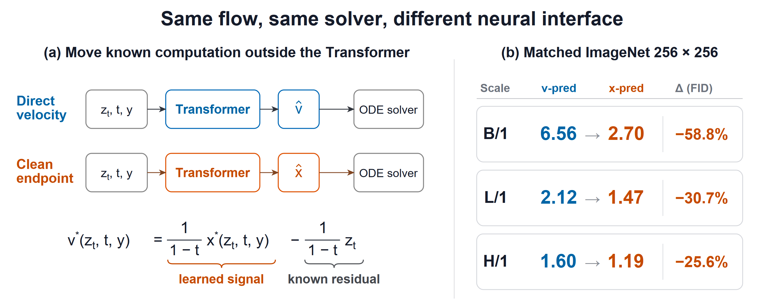
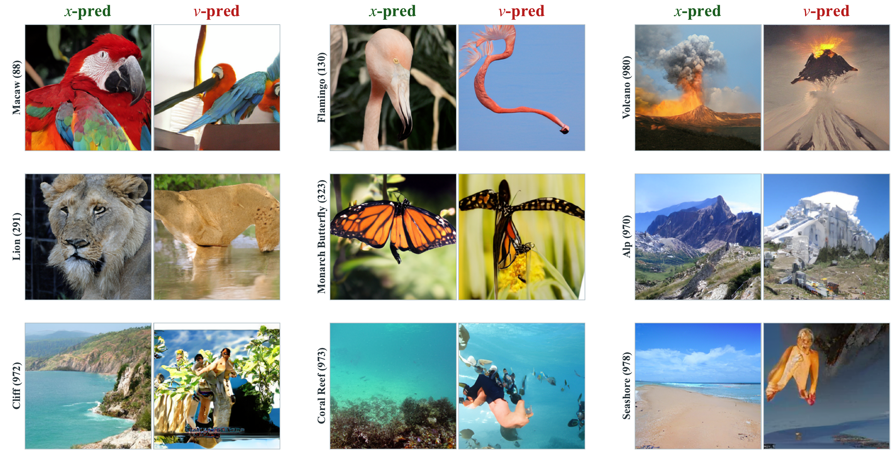
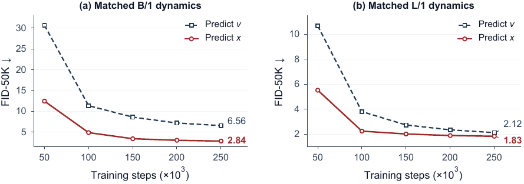
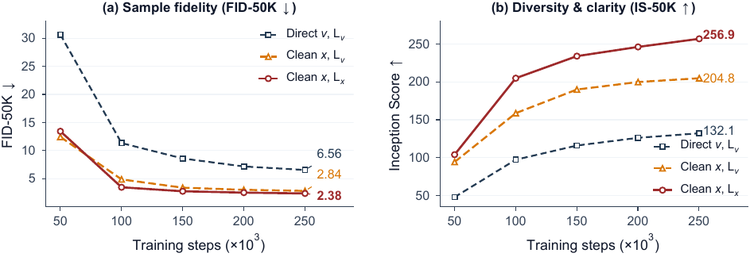

# Equivalent Flows, Unequal Learning: Clean-Latent Prediction in Transformers

<div align="center">

[](https://arxiv.org/abs/2605.27102)
[](https://akatsuki-neo.github.io/JLT)
[](https://huggingface.co/dawn-neo/JLT)

</div>

<div align="center">

<br><br>
JLT is a latent Transformer that predicts the clean VAE endpoint and converts it to velocity with a fixed affine readout. The ODE solver still consumes velocity. What changes is which quantity the network has to learn. On class-conditional ImageNet 256×256 with a frozen FLUX.2 VAE, matched clean-latent prediction improves FID-50K from 6.56 to 2.84 at Base, from 2.12 to 1.83 at Large, and from 1.60 to 1.19 at Huge. Direct clean regression at Base, without the induced time weighting, reaches 2.38.
</div>


<div align="center">
<br>

<br><br>
Matched Base-scale samples. Random class-conditional generations from B/1 models. Clean prediction keeps global structure and detail; direct velocity prediction more often distorts or blurs.
</div>

## Authors

[**Funing Fu**](https://github.com/chinoll)<sup>1\*</sup> · [**Tenghui Wang**](https://github.com/spawner1145)<sup>2\*</sup> · [**Guanyu Zhou**](https://the-martyr.github.io/)<sup>3</sup> · Junyong Cen<sup>1</sup> · Qichao Zhu<sup>4</sup>

<sup>1</sup> Independent Researcher · <sup>2</sup> Wuhan University of Technology · <sup>3</sup> Technology Innovation Institute · <sup>4</sup> Hangzhou Jiyi AI

\* Equal contribution

## Implementation

### Installation

```bash
git clone https://github.com/akatsuki-neo/JLT.git
cd JLT

conda env create -f environment.yaml
conda activate jit

pip install accelerate
pip install torch-fidelity
```

### Data Preparation

Download ImageNet train/val from [image-net.org](https://image-net.org/download.php), then encode it with the frozen FLUX.2 VAE:

```bash
python prepare_ref.py \
    --data_path /path/to/imagenet \
    --output_path /path/to/imagenet_latents_256 \
    --img_size 256 \
    --vae_type flux2 \
    --vae_model_name_or_path black-forest-labs/FLUX.2-klein-4B \
    --batch_size 256 \
    --num_workers 8
```

This produces safetensor latent shards in `/path/to/imagenet_latents_256`.

### Training

The checked-in launcher trains JLT-B/1 (clean latent, patch 1 on the 16×16 FLUX grid):

```bash
./start_latent_jit_16.sh [GPU_IDS]

# Example: GPUs 0-3
./start_latent_jit_16.sh 0,1,2,3
```

That script uses batch size 256, gradient accumulation 2, base learning rate 5e-5, CFG 2.9, and 40 epochs. The reported paper runs use the same optimizer recipe for 200 epochs (about 250K steps) at Base, Large, and Huge.

`--flow_matching` switches the network to direct velocity prediction. The patch-2 launcher is `start_latent_jit_32.sh`. The matched velocity baseline is `start_latent_v_32.sh`.

### Key Arguments

| Argument | Description |
|----------|-------------|
| `--model` | Architecture name: `JiT-B/1`, `JiT-B/2`, `JiT-B/16` |
| `--vae_type` | `flux2` for the FLUX.2 latent space |
| `--flow_matching` | Predict velocity directly instead of the clean latent |
| `--batch_size` | Micro-batch per GPU |
| `--blr` | Base learning rate |
| `--epochs` | Training epochs |
| `--cfg` | Classifier-free guidance scale |
| `--data_path` | Path to pre-encoded latents |
| `--use_latent_cache` | Load pre-encoded safetensor latents |
| `--vae_model_name_or_path` | FLUX.2 VAE path or HuggingFace repo |

### Evaluation

Download the checkpoint from HuggingFace and run evaluation:

```bash
huggingface-cli download dawn-neo/JLT checkpoint-last.pth

python main_jit.py \
    --model JiT-B/1 \
    --vae_type flux2 \
    --img_size 256 \
    --data_path /path/to/imagenet_latents_256 \
    --use_latent_cache \
    --online_eval \
    --eval_freq 1 \
    --gen_bsz 128 \
    --num_images 50000 \
    --cfg 2.9 \
    --num_sampling_steps 50 \
    --resume /path/to/checkpoint-last.pth \
    --output_dir ./eval_output
```

FID uses 50K samples. See [torch-fidelity](https://github.com/toshas/torch-fidelity).

## Method

Images are encoded by a frozen VAE. The linear path is

$$z_t = t x + (1 - t) \epsilon, \quad t \in [0, 1],$$

with sample-wise velocity $v = x - \epsilon$. A clean prediction converts to the same velocity by

$$\hat v = \frac{\hat x - z_t}{1 - t}.$$

For squared error, the optimal clean and velocity predictors are algebraically equivalent. A finite Transformer is not: predicting $v$ has to represent the input residual and time-dependent gain internally, while predicting $x$ leaves that response to the readout.

Under a local Gaussian model, velocity also adds a unit floor to every latent direction. Measured FLUX.2 channel spectra match that shift. Clean eigenvalues span 10.50 to 0.21 (condition number 50.36, effective rank 35.10). Velocity eigenvalues span 11.50 to 1.21 (condition number 9.52, effective rank 78.97). Capturing 90% of target variance takes 83 clean directions and 109 velocity directions.

## Architecture

| Model | Depth | Width | Heads | Params |
|-------|------:|------:|------:|-------:|
| JLT-B/1 | 12 | 768 | 12 | 130.5M |
| JLT-L/1 | 24 | 1024 | 16 | 458.1M |
| JLT-H/1 | 32 | 1280 | 16 | 951.3M |

Parameter counts exclude the frozen VAE. Blocks use self-attention, SwiGLU, RMSNorm, rotary embeddings, and adaptive time/class modulation. The paper runs use patch size 1, so the 16×16 latent grid stays 256 tokens.

## Experiments

Class-conditional ImageNet-1K at 256×256. Unless noted, models train for 200 epochs, sample with 50-step Heun, and use CFG 2.9 over $[0.1, 1]$. Time is drawn from $\mathrm{logit}(t) \sim \mathcal{N}(-0.8, 0.8^2)$. The Huge comparison below uses each model's best FID instead of the shared CFG 2.9 point.

### Matched Prediction Target

Within each scale, the VAE, architecture, velocity loss, schedule, and sampler stay fixed. Only the network output changes.

| Scale | Network predicts | Loss | FID-50K ↓ | IS ↑ |
|-------|------------------|------|----------:|-----:|
| B/1 | velocity $v$ | $\mathcal{L}_v$ | 6.56 | 132.12 |
| B/1 | **clean latent $x$** | $\mathcal{L}_v$ | **2.84** | **204.83** |
| L/1 | velocity $v$ | $\mathcal{L}_v$ | 2.12 | 236.21 |
| L/1 | **clean latent $x$** | $\mathcal{L}_v$ | **1.83** | **301.07** |
| H/1 | velocity $v$ | $\mathcal{L}_v$ | 1.60 | **327.41** |
| H/1 | **clean latent $x$** | $\mathcal{L}_v$ | **1.19** | 271.96 |

Clean prediction cuts FID by 3.72 (56.7%) at Base and 0.29 (13.7%) at Large. At 951.3M parameters it reaches 1.19. That Huge number is the FID-optimal CFG 2.2 point, paired with IS 271.96; the same sweep peaks at IS 334.21 at CFG 3.0.

<div align="center">

<br><br>
Matched training curves. Clean prediction stays ahead at every measured checkpoint: B/1 ends at 2.84 versus 6.56, and L/1 ends at 1.83 versus 2.12.
</div>

### Loss Weighting

Holding the clean output fixed, velocity-space MSE induces a $(1-t)^{-2}$ weight on the clean error. Replacing it with unweighted clean MSE does not remove the gain.

| Model | Predicts | Loss | Weight on $\|\hat x - x\|_2^2$ | FID-50K ↓ | IS ↑ |
|-------|----------|------|-------------------------------|----------:|-----:|
| B/1 velocity | $v$ | $\mathcal{L}_v$ | — | 6.56 | 132.12 |
| JLT-B/1 | $x$ | $\mathcal{L}_v$ | $(1-t)^{-2}$ | 2.84 | 204.83 |
| JLT-B/1 | $x$ | $\mathcal{L}_x$ | $1$ | **2.38** | **256.88** |

<div align="center">

<br><br>
Base-scale loss ablation. Both clean objectives beat direct velocity throughout training. Unweighted clean MSE finishes at FID 2.38 and IS 256.88.
</div>

### Reference Models

Guided ImageNet 256×256 numbers below are taken from the cited reports. JLT-H/1 is the FID-optimal CFG 2.2 evaluation and does not use an external representation-alignment loss.

| Model | Space | Extra rep. | Params | FID-50K ↓ | IS ↑ |
|-------|-------|------------|-------:|----------:|-----:|
| DiT-XL/2 | VAE | — | 675M | 2.27 | 278.20 |
| SiT-XL/2 | VAE | — | 675M | 2.06 | 277.50 |
| REPA-SiT-XL/2 | VAE | DINOv2 | 675M | 1.42 | 305.70 |
| MDTv2-XL/2 | VAE | — | 675.8M | 1.58 | 314.73 |
| DiffiT | VAE | — | 561M | 1.73 | 276.49 |
| JiT-H/16 | pixel | — | 953M | 1.86 | 303.40 |
| RiT | DINOv2 | DINOv2 | 676M | **1.14** | — |
| **JLT-H/1** | VAE | — | 951.3M | 1.19 | 271.96 |

### Other Checks

- **Qwen-VAE, matched B/1.** The same clean-versus-velocity comparison at CFG 2.9 ends at FID 6.54 versus 6.85 after 250K steps. Clean prediction is lower at 150K, 200K, and 250K.
- **CFG sweeps.** JLT-B/1 FID falls through the grid and is 2.70 at CFG 3.0. JLT-H/1 FID is lowest at 1.19 when CFG is 2.2.

## Citation

```bibtex
@article{fu2026jlt,
  title={{JLT}: {C}lean-{L}atent {P}rediction in {L}atent {D}iffusion {T}ransformers},
  author={Fu, Funing and Wang, Tenghui and Zhou, Guanyu and Cen, Junyong and Zhu, Qichao},
  journal = {arXiv preprint arXiv:2605.27102},
  year={2026}
}
```

## Acknowledgements

- Li & He. "Back to Basics: Let Denoising Generative Models Denoise." arXiv:2511.13720, 2025.
- JiT GitHub: https://github.com/LTH14/JiT
- Black Forest Labs. FLUX.2 Small Decoder. HuggingFace, 2026.
